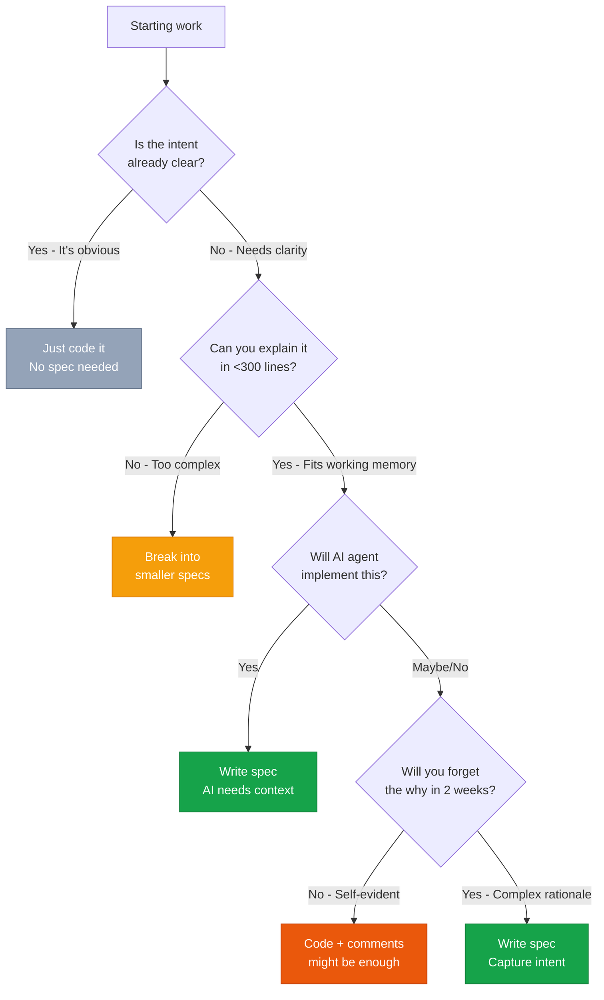

# When to Use LeanSpec

> "In AI-powered development, specs bridge human intent to machine execution."

This guide helps you decide **when** to write a spec—and when not to. The core question: **Does a spec add value in the human-AI development loop?**

If you're new to LeanSpec, start with [Understanding LeanSpec](/docs/guide/understanding) for the foundational concepts.

## The Core Decision

LeanSpec is designed for **AI-powered SDD**. Write a spec when it helps **bridge human intent to machine execution**. Skip it when the gap is already clear.

### Write a Spec When...

**🎯 Intent needs clarification:**
- Multiple valid interpretations exist
- Trade-offs or constraints aren't obvious
- "Why" matters as much as "what"
- Decisions need to be documented

**🤖 AI will implement:**
- AI agent needs executable context
- Success criteria must be explicit
- Constraints aren't inferable from code
- Implementation paths need to be narrowed

**🏗️ Work is significant:**
- Touches multiple parts of the system
- Architectural or structural changes
- Breaking changes or major refactors
- Cross-system dependencies

**📚 Knowledge needs capture:**
- Research findings and trade-offs
- Technical exploration or experiments
- Retrospectives (what worked, what didn't)
- Decisions for future reference

**Examples:**
- New feature with AI implementation
- API design affecting multiple consumers
- Architecture decision (microservices vs monolith)
- Significant refactoring (not trivial renames)
- Research spike documenting findings
- Retrospective capturing learnings

### Skip the Spec When...

**✂️ Intent is self-evident:**
- Obvious bug fixes (clear cause, clear fix)
- Trivial refactoring (rename, extract function, format)
- Well-documented in code/comments already
- Change is purely mechanical

**🔬 Work is exploratory:**
- Rapid prototyping to discover requirements
- Experimenting with multiple approaches
- High uncertainty, likely to throw away
- Learning by doing is faster

*Note: Write a spec after prototyping to capture learnings*

**📄 Wrong tool for the job:**
- API reference docs (use auto-generated docs)
- User manuals (use dedicated tools)
- Compliance docs with specific formats (use required format)
- Dependency updates (standard version bumps)

**Examples:**
- One-line bug fix
- Simple rename or code formatting
- Standard dependency version bump
- Experimental prototype (document after if it works)

## Decision Framework

**The Core Question:**
> "Will a spec help bridge human intent to machine execution, or is the gap already clear?"

### Quick Reference

**Write a spec when any of these are true:**
- 🤖 AI agent will implement
- 🎯 Multiple valid interpretations exist
- 🏗️ Touches multiple parts of the system
- 📚 Decisions need future reference
- 🔄 Significant refactoring or architectural change
- 🔬 Research findings or retrospectives to capture

**Skip the spec when all of these are true:**
- ✂️ Intent is self-evident
- 🎨 Change is trivial or mechanical
- 📝 Already well-documented in code
- ⚡ Rapid prototyping (document after if it works)

**Key insight:** In AI-powered SDD, specs aren't about coordination—they're about **context**. The question isn't "Do we need to align?" but "Does AI need explicit context to execute correctly?"

## Common Scenarios

### Solo Development
**When to spec:**
- Features you'll forget in a month
- Complex decisions for future you
- AI-implemented features

**When to skip:**
- Obvious changes
- Self-documenting code
- Experiments you'll likely discard

### Team Development
**When to spec:**
- Work spanning multiple people
- Architectural decisions
- Breaking changes or refactors
- AI-powered implementation

**When to skip:**
- Everyone already knows what to do
- Trivial changes
- Quick experiments

### AI-Powered Development
**When to spec:**
- Always when AI agent implements
- Complex intent or constraints
- Multiple implementation paths
- Success criteria need explicit definition

**When to skip:**
- AI can infer from existing patterns
- Change is purely mechanical
- Intent is crystal clear from code

## The Bottom Line

**Write a spec when:**
- Intent isn't obvious (ambiguity, complexity, trade-offs)
- AI agent will implement (needs executable context)
- Work is significant (cross-system, architectural)
- Knowledge needs capture (research, retrospectives, decisions)

**Skip the spec when:**
- Intent is self-evident (obvious bug fix, trivial refactor)
- Work is exploratory (rapid prototyping, experiments)
- Wrong tool (API reference, user manuals, compliance docs)

**When in doubt:**
- Ask: "Does this bridge human intent to machine execution?"
- If yes → Write it (keep it \<300 lines)
- If no → Skip it or use code/comments
- Apply [First Principles](/docs/guide/understanding) to guide judgment

**Remember:** Specs serve the human-AI development loop. If a spec doesn't add value there, it's overhead.

---

**Next:** Learn [How to Write Specs](/docs/guide/ai-executable-patterns) using the 12 Patterns for AI-Executable Specs, or explore [Templates](/docs/guide/templates) to get started quickly.
