# Burst Mode Orchestrator (BMO) - Iterative Test-Driven AI Coding Pattern

> **Status**: 🗓️ Planned · **Priority**: High · **Created**: 2025-12-17 · **Tags**: ai-agents, orchestration, testing, automation, coding-pattern, quality-over-speed


## Vision & Objectives

Build an intelligent code orchestrator based on **LeanSpec** to achieve an automated closed-loop "Spec-Driven Development" workflow.

The core concept is **"Burst Mode"**: trading computational resources (tokens) and time for exceptionally high code quality. The system takes over the "code-test-fix" PDCA cycle until the code passes all defined specifications or reaches maximum iterations, significantly reducing human intervention in code review and minor fixes.

**Core Values:**

* **Quality over Speed:** The process can be slow, but results must be accurate.
* **Spec as Truth:** Code is only complete when it satisfies all spec requirements AND passes formal tests.
* **Autonomous Iteration:** Automated error analysis and self-correction.

## Relationship to Other Specs

This spec defines a **coding pattern** that can be implemented within the orchestration infrastructure defined in:

* **123-ai-coding-agent-integration**: Provides the dispatch interface for triggering AI agents. Burst mode integrates via `--burst` flag on `agent run` command.
* **158-persistent-agent-sessions**: Enables multi-phase workflows (each burst iteration = one phase)
* **168-leanspec-orchestration-platform**: Desktop app UI for controlling burst sessions

BMO is **not** a standalone tool but a **pattern** for orchestrating agents:

```mermaid
graph TB
    User[User] -->|"Define Spec + Tests"| Spec[LeanSpec Document]
    Spec -->|"Dispatch with max_iterations"| BMO[Burst Mode Pattern]
    BMO -->|"Phase 1: Implement"| Agent[AI Coding Agent]
    Agent -->|"Generate Code"| Executor[Test Executor]
    Executor -->|"Tests Pass"| Critic[Spec Verification]
    Executor -->|"Tests Fail + Logs"| Critic
    Critic -->|"Incomplete/Failed"| Agent
    Critic -->|"All Requirements Met"| Done[✅ Complete]
    
    style BMO fill:#e1f5ff,stroke:#1e3a8a,stroke-width:2px,color:#1e3a8a
    style Done fill:#d1fae5,stroke:#065f46,stroke-width:2px,color:#065f46
    style Executor fill:#fff4e1,stroke:#92400e,stroke-width:2px,color:#92400e
```



## System Architecture

The system uses an **Agentic Loop** architecture. It's not just code generation, but a "generate + verify" combination.

### Core Components

1. **Planner:** Receives natural language requirements and converts them into structured Spec and Test Cases.
2. **Coder:** Generates/modifies implementation code based on the Spec.
3. **Executor (Sandbox):** A secure runtime (Node.js/Docker) that runs tests and captures `stdout/stderr`.
4. **Critic (Verification Engine):** Analyzes test results AND verifies spec completion. Performs comprehensive validation:
   - **Test Analysis:** Analyzes error logs and stack traces when tests fail
   - **Spec Verification:** Even when tests pass, validates all requirements are implemented
   - **Acceptance Criteria (AC) Check:** Ensures all ACs are met
   - **Completeness Audit:** Prevents false positives from self-claimed "passes"
   - **Gap Analysis:** Identifies missing functionality not covered by tests

### Component Interaction

```
┌─────────────┐
│   Planner   │ ← User Input (Natural Language)
└──────┬──────┘
       │ Generates: Spec + Test Suite + Acceptance Criteria
       ▼
┌─────────────┐
│    Coder    │ ← Context: Spec + Previous Feedback
└──────┬──────┘
       │ Generates: Implementation Code
       ▼
┌─────────────┐
│  Executor   │ ← Runs: npm test / pytest
└──────┬──────┘
       │ Captures: stdout/stderr + Exit Code + Coverage
       ▼
┌─────────────┐
│   Critic    │ ← Analyzes: Test Results + Spec + Code + ACs
└──────┬──────┘
       │
       ├─> Tests Failed? → Error Analysis → Refinement Prompt
       │
       ├─> Tests Passed? → Spec Verification:
       │                    • All requirements implemented?
       │                    • All ACs met?
       │                    • No missing functionality?
       │                    • Code matches spec intent?
       │
       ├─> Incomplete → Gap Analysis → Refinement Prompt
       │
       └─> Complete & Verified → ✅ Done
```

## Workflow Logic (The Burst Loop)

The orchestrator's core is a `while` loop with the following logic:

### Initialization Phase

1. **User Input** → Generate Spec (using LeanSpec format)
2. **Generate Test Cases** → Jest/Vitest/pytest test files
3. **Define Acceptance Criteria** → Explicit, verifiable conditions for completion
4. **Human Approval** → User reviews and approves Spec + Tests + ACs

### Burst Loop

```javascript
const maxIterations = 10; // Configurable burst limit
let iteration = 0;

while (iteration < maxIterations) {
  // Step 1: Generate/Refine Implementation
  const code = await coder.generate({
    spec: spec,
    previousErrors: errors,
    context: context
  });
  
  // Step 2: Execute Tests
  const result = await executor.run("npm test");
  
  // Step 3: Critic Verification (even if tests pass)
  const verification = await critic.verify({
    spec: spec,
    acceptanceCriteria: acceptanceCriteria,
    code: code,
    testResult: result,
    coverage: result.coverage
  });
  
  // Step 4: Check Verification Result
  if (verification.status === 'complete') {
    console.log("✅ All requirements met and verified!");
    return { 
      success: true, 
      code, 
      iterations: iteration + 1,
      verificationReport: verification.report
    };
  }
  
  // Step 5: Analyze Gap/Failure
  const analysis = verification.analysis; // Contains test errors OR spec gaps
  
  // Step 6: Update Context for Next Iteration
  errors = analysis.refinementPrompt;
  context = { ...context, failureHistory: [...context.failureHistory, analysis] };
  
  iteration++;
}

// Max iterations reached without passing
throw new Error(`Burst failed after ${maxIterations} iterations. Manual intervention required.`);
```

### Loop Cases

* **Case A (Tests Fail):** Capture error logs (stack trace), analyze root cause, generate fix prompt.
* **Case B (Tests Pass, Spec Incomplete):** Tests pass but Critic detects missing requirements/ACs → Generate gap analysis prompt.
* **Case C (Tests Pass, False Positive):** Tests pass but implementation doesn't match spec intent → Refine implementation.
* **Case D (Complete & Verified):** All tests pass AND all spec requirements met → **Exit loop, deliver code**.
* **Case E (Compilation/Syntax Error):** Critic analyzes and suggests fixes.
* **Case F (Max Iterations):** Reached limit without completion → **Error and require manual intervention**.

## Key Design Decisions

### 1. Why "Burst Mode"?

**Traditional Workflow Problems:**
- After AI generates code, humans manually run tests
- After finding errors, need to manually describe issues back to AI
- Multiple round-trips, low efficiency, unstable quality
- False positives: "tests pass" doesn't guarantee spec completion

**Burst Mode Advantages:**
- Automated PDCA cycle with no human intervention
- System automatically captures and analyzes errors
- Continuous iteration until verified complete or max iterations reached
- Critic prevents false positives by verifying spec compliance

### 2. Sandbox Execution Environment

**Security Requirements:**
- Code may contain malicious instructions or infinite loops
- Need isolated execution environment (Docker/VM)
- Resource limits (CPU/memory/time)

**Implementation Options:**
```yaml
Option 1: Docker Container
  Pros: Strong isolation, cross-platform
  Cons: Slow startup (~2-3s per iteration)

Option 2: VM2 (Node.js Sandbox)
  Pros: Fast startup (~100ms)
  Cons: JavaScript only, weaker isolation

Option 3: WebAssembly
  Pros: Near-native performance, secure
  Cons: Ecosystem not mature
```

**Recommended Approach:** Hybrid mode
- Use lightweight sandbox (VM2/Deno) for initial iterations
- Use Docker for verification when nearing completion

### 3. Critic Verification Strategy

The Critic is a **two-phase verification engine**: Test Analysis + Spec Verification.

#### Phase 1: Test Analysis (when tests fail)

| Error Type | Analysis Strategy | Example |
|-----------|------------------|------|
| **Syntax Error** | Extract line number and error message | `SyntaxError: Unexpected token '}' at line 42` |
| **Type Error** | Analyze type mismatch, suggest type correction | `TypeError: Cannot read property 'x' of undefined` |
| **Logic Error** | Compare expected vs actual values, infer logic issues | `Expected: [1,2,3], Received: [1,2,2]` |
| **Timeout** | Identify potential infinite loops, suggest exit conditions | `Test exceeded 5000ms timeout` |

#### Phase 2: Spec Verification (always runs)

Even when tests pass, verify:

| Check Type | Verification Method | Prevents |
|-----------|-------------------|----------|
| **Requirement Coverage** | Map spec requirements to code implementation | Incomplete features |
| **AC Compliance** | Validate each acceptance criterion is met | Partial implementations |
| **Functionality Gaps** | Compare spec intent vs actual behavior | Tests that don't cover all scenarios |
| **False Positives** | Cross-reference test assertions with spec requirements | Passing tests that miss key requirements |
| **Edge Cases** | Verify boundary conditions mentioned in spec | Brittle implementations |

**Enhanced Techniques:**
- **Semantic Diff:** Compare code changes to judge fix effectiveness
- **Pattern Matching:** Identify common error patterns (e.g., off-by-one)
- **Context Retention:** Retain failure history to avoid repeated errors
- **Requirement Tracing:** Track each spec requirement to its implementation
- **AC Checklist:** Maintain explicit checklist of acceptance criteria
- **Intent Matching:** Use AI to verify code matches spec intent, not just mechanics

### 4. Context Economy

Token consumption per iteration:

```
Iteration 1: Spec (2k) + Test Suite (1k) + ACs (0.5k) + Prompt (0.5k) = 4k tokens
Iteration 2: Spec (2k) + Test Suite (1k) + ACs (0.5k) + Error Log (0.5k) + Prompt (0.5k) = 4.5k tokens
Iteration N: Spec (2k) + Test Suite (1k) + ACs (0.5k) + Verification Report (1k) + Prompt (0.5k) = 5.5k tokens
```

**Optimization Strategies:**
- **Error Log Compression:** Keep only last 3 failures' stack traces
- **Incremental Updates:** Pass code diffs instead of full code
- **Smart Truncation:** Auto-remove old error records when exceeding 10k tokens
- **AC Checklist Format:** Use compact checklist format instead of verbose descriptions
- **Verification Summaries:** Compress verification reports to essential gaps only

## Implementation Roadmap

### Phase 1: Proof of Concept (1-2 weeks)

**Goal:** Validate Burst Loop feasibility

**Scope:**
- [ ] Simple Coder (Claude/GPT API calls)
- [ ] Basic Executor (local `npm test`)
- [ ] Naive Critic (forward test errors only, no spec verification)
- [ ] Unit test scenarios (calculator, string processing)

**Success Criteria:** At least 80% of simple test cases pass within 5 iterations

### Phase 2: Spec Verification (2-3 weeks)

**Goal:** Add comprehensive verification to prevent false positives

**Scope:**
- [ ] Requirement coverage tracking
- [ ] AC checklist validation
- [ ] Spec-to-code mapping
- [ ] Gap analysis when tests pass but spec incomplete
- [ ] Intent matching using AI

**Success Criteria:** Zero false positives (tests pass but spec incomplete)

### Phase 3: Enhanced Analysis (2-3 weeks)

**Goal:** Improve Critic intelligence for faster convergence

**Scope:**
- [ ] Error classification system
- [ ] Pattern matching rule library
- [ ] Semantic diff analysis
- [ ] Context retention strategy

**Success Criteria:** Average iterations reduced from 5 to 3

### Phase 4: Production Integration (3-4 weeks)

**Goal:** Integrate into LeanSpec ecosystem

**Scope:**
- [ ] Desktop App UI (Tauri)
- [ ] CLI integration via `lean-spec agent run <spec> --burst` flag
- [ ] `--max-iterations <n>` option (default: 10)
- [ ] Burst mode context injection in agent prompts
- [ ] Sandbox environment (Docker)
- [ ] Monitoring and logging

**CLI Usage:**
```bash
# Enable burst mode for single spec
lean-spec agent run 045 --burst

# Burst mode with custom iterations
lean-spec agent run 045 --burst --max-iterations 15

# Burst mode with specific agent
lean-spec agent run 045 --agent claude --burst

# Dry run to preview burst workflow
lean-spec agent run 045 --burst --dry-run
```

**Success Criteria:** One-click Burst Mode trigger from Desktop App and CLI flag support

### Phase 5: Advanced Features (Future)

**Possible Directions:**
- [ ] Multi-language support (Python, Go, Rust)
- [ ] Parallel Burst (run multiple test suites simultaneously)
- [ ] AI-to-AI Communication (multi-agent collaboration)
- [ ] Adaptive maxIterations (dynamically adjust based on complexity)
- [ ] Human-in-the-loop for ambiguous ACs

## Success Metrics

| Metric | Target | Notes |
|--------|--------|-------|
| **Completion Rate** | >90% | Simple scenarios (single file, <200 LOC) |
| **False Positive Rate** | <5% | Tests pass but spec incomplete |
| **Average Iterations** | <5 | Including initial generation |
| **Time per Iteration** | <30s | Including API calls + test execution |
| **Token Consumption** | <50k per burst | Based on Claude Sonnet 3.5 |
| **Verification Accuracy** | >95% | Critic correctly identifies incomplete specs |
| **User Satisfaction** | >4.5/5 | Via NPS survey |

## Risks & Mitigation

| Risk | Impact | Mitigation |
|------|--------|------------|
| **Infinite Loop (Code)** | System hang | Executor 5-minute timeout |
| **Infinite Loop (Logic)** | Token waste | Detect repeated errors, early termination |
| **High Token Cost** | Financial loss | Daily limits, cost estimation |
| **Sandbox Escape** | Security risk | Use Docker/gVisor, block network access |
| **AI Hallucination** | Invalid code | Critic validates syntax, rejects obvious errors |
| **False Positives** | Incomplete deliverables | Two-phase verification (tests + spec) |
| **Ambiguous Specs** | Wrong implementation | Require explicit ACs, human review |
| **Over-verification** | Slow convergence | Balance strictness vs pragmatism |

## Technology Stack

```yaml
Frontend (Desktop):
  Framework: Tauri v2 (Rust + TypeScript)
  UI Library: React + shadcn/ui
  State Management: Zustand

Backend (Orchestration):
  Runtime: Node.js 20+
  Language: TypeScript
  Framework: None (lightweight CLI)

AI Integration:
  Primary: Claude Sonnet 3.5 (via Anthropic SDK)
  Fallback: GPT-4 Turbo (via OpenAI SDK)
  
Executor:
  Sandbox: Docker 24+ (production)
  Sandbox: Deno (development)
  
Database (Session Storage):
  Primary: SQLite (local)
  Future: PostgreSQL (cloud sync)
```

## Open Questions

1. **How to handle tests requiring human judgment?** (e.g., UI tests, visual regression tests)
   - Possible solution: Provide "human verification" step, pause Burst for confirmation

2. **Should we support incremental testing?** (run only failed tests, not entire suite)
   - Advantage: Save time
   - Risk: May introduce new errors

3. **How to integrate with Git?**
   - Create commit per iteration?
   - Commit only after verification complete?

4. **How to handle ambiguous acceptance criteria?**
   - Require human clarification mid-burst?
   - Use AI to infer intent with confidence scores?

5. **When should Critic be strict vs lenient?**
   - Balance between completeness and pragmatism
   - Different modes for different project types?

6. **How does `--burst` flag interact with other agent options?**
   - Can burst mode work with `--parallel` (worktrees)?
   - Should burst mode auto-enable certain agents (e.g., Claude for best reasoning)?
   - How to handle burst mode in cloud agents (gh-coding)?

## References

- [Test-Driven Development (TDD)](https://martinfowler.com/bliki/TestDrivenDevelopment.html)
- [PDCA Cycle](https://en.wikipedia.org/wiki/PDCA)
- [Docker Security Best Practices](https://docs.docker.com/engine/security/)
- [LeanSpec First Principles](../docs/advanced/first-principles.mdx)

---

**Next Steps:** Build Phase 1 POC to validate core assumptions, then immediately add spec verification in Phase 2 to prevent false positives.
