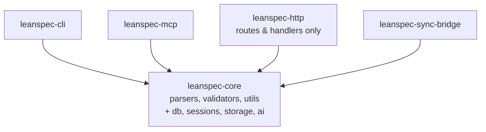

# Rust Monorepo Architecture Refactoring: Consolidate into Core

## Overview

The current Rust monorepo has tightly coupled components scattered across packages. Key issues:

1. **Sessions Management** - Embedded in `leanspec-http/sessions/` but CLI needs it
2. **Database Infrastructure** - SQLite code duplicated (sessions.db, chat.db) 
3. **Chat Storage** - Tightly coupled to HTTP server
4. **AI Worker Management** - HTTP-specific but conceptually independent
5. **Project Registry** - Could be shared infrastructure
6. **Configuration System** - Scattered with duplication

### Current Problems

- CLI depends on `leanspec-http` just to access session management
- Database schema management duplicated
- Infrastructure code mixed with HTTP presentation layer
- Difficult to test components in isolation
- CLI binary includes unnecessary HTTP server overhead

### Proposed Solution

**Move db/sessions/storage into `leanspec-core`** to create a comprehensive core library that both CLI and HTTP can depend on directly.

## Design

### Current Structure (Problematic)

```
rust/
├── leanspec-core/          # Only spec parsing/validation
├── leanspec-cli/           # Depends on HTTP just for sessions ❌
├── leanspec-http/          # Contains sessions/db/storage/config
│   ├── sessions/
│   ├── chat_store.rs
│   ├── project_registry.rs
│   └── config.rs
├── leanspec-mcp/
└── leanspec-sync-bridge/
```

### Proposed Structure (Clean)

```
rust/
├── leanspec-core/          # EXPANDED - Now includes infrastructure
│   ├── parsers/            # (existing)
│   ├── types/              # (existing)  
│   ├── utils/              # (existing)
│   ├── validators/         # (existing)
│   ├── db/                 # NEW - Database infrastructure
│   │   ├── mod.rs
│   │   ├── connection.rs
│   │   ├── migrations.rs
│   │   └── error.rs
│   ├── sessions/           # NEW - Session management
│   │   ├── mod.rs
│   │   ├── types.rs
│   │   ├── database.rs
│   │   ├── manager.rs
│   │   └── adapters/
│   │       ├── mod.rs
│   │       ├── claude.rs
│   │       ├── copilot.rs
│   │       ├── codex.rs
│   │       └── opencode.rs
│   ├── storage/            # NEW - Generic storage
│   │   ├── mod.rs
│   │   ├── chat.rs
│   │   ├── projects.rs
│   │   └── config.rs
│   └── ai/                 # NEW - AI worker management
│       ├── mod.rs
│       ├── manager.rs
│       ├── protocol.rs
│       └── worker.rs
├── leanspec-cli/           # Now depends only on core ✓
├── leanspec-http/          # Now depends only on core ✓
│   ├── routes/
│   ├── handlers/
│   └── state.rs
├── leanspec-mcp/
└── leanspec-sync-bridge/
```

### Dependency Graph



**Much simpler!** Everyone just depends on core.

### Module Responsibilities in Core

#### `core::db` (NEW)
- SQLite connection management
- Schema migrations infrastructure
- Common database operations
- Error handling and retry logic
- Transaction support

#### `core::sessions` (MOVED FROM HTTP)
- Session types and lifecycle
- Session database operations
- Tool adapters (Claude, Copilot, Codex, OpenCode)
- Session manager with async execution
- Process spawning and log capture

#### `core::storage` (MOVED FROM HTTP)
- Chat store (SQLite-backed)
- Project registry
- Generic storage abstractions
- Configuration persistence

#### `core::ai` (MOVED FROM HTTP)
- AI worker management
- Worker protocol definitions
- Chat payload handling

#### Updated Packages

**`leanspec-http`** (REDUCED SCOPE)
- HTTP routes and handlers **only**
- Request/response serialization
- Middleware (CORS, logging)
- WebSocket handlers
- All business logic delegates to `core::`

**`leanspec-cli`** (SIMPLIFIED)
- Command definitions and parsing
- Output formatting
- Direct usage of `core::sessions`, `core::storage`
- **No HTTP dependency** ✓

## Plan

### Phase 1: Expand Core Dependencies
- [ ] Update `leanspec-core/Cargo.toml` to add infrastructure deps:
  - `rusqlite` with bundled feature
  - `tokio` for async runtime
  - `uuid` for ID generation
  - `async-trait` for trait async methods
  - `dirs` for system paths
  - `which` for binary detection
- [ ] Add optional features for infrastructure (sessions, storage, ai)
- [ ] Write unit tests for new dependencies

### Phase 2: Move Database Infrastructure to Core
- [ ] Create `leanspec-core/src/db/` module
- [ ] Move common SQLite patterns from sessions/chat stores
- [ ] Implement connection management and pooling
- [ ] Create migration framework
- [ ] Add comprehensive error types
- [ ] Write unit tests

### Phase 3: Move Sessions to Core
- [ ] Create `leanspec-core/src/sessions/` module
- [ ] Move types from `leanspec-http/sessions/types.rs`
- [ ] Move database from `leanspec-http/sessions/db.rs`
- [ ] Move manager from `leanspec-http/sessions/manager.rs`
- [ ] Move adapters from `leanspec-http/sessions/adapter.rs`
- [ ] Update to use `core::db`
- [ ] Ensure no HTTP dependencies
- [ ] Add integration tests

### Phase 4: Move Storage to Core
- [ ] Create `leanspec-core/src/storage/` module
- [ ] Move chat_store from `leanspec-http/chat_store.rs`
- [ ] Move project_registry from `leanspec-http/project_registry.rs`
- [ ] Move config from `leanspec-http/config.rs`
- [ ] Update to use `core::db`
- [ ] Write unit and integration tests

### Phase 5: Move AI Worker to Core
- [ ] Create `leanspec-core/src/ai/` module
- [ ] Move from `leanspec-http/ai/` directory
- [ ] Update imports
- [ ] Add tests

### Phase 6: Update HTTP Package
- [ ] Delete moved modules (sessions/, ai/, chat_store.rs, etc.)
- [ ] Update imports to use `leanspec_core::`
- [ ] Simplify state management
- [ ] Update handlers to delegate to core
- [ ] Ensure all HTTP tests pass
- [ ] Update API documentation

### Phase 7: Update CLI Package
- [ ] Remove `leanspec-http` dependency from Cargo.toml
- [ ] Update imports to use `leanspec_core::sessions`
- [ ] Update session command implementation
- [ ] Verify CLI tests pass
- [ ] Measure binary size reduction

### Phase 8: Update Other Packages
- [ ] Update sync-bridge if needed
- [ ] Update workspace Cargo.toml
- [ ] Verify all packages compile

### Phase 9: Documentation & Cleanup
- [ ] Update `leanspec-core/README.md` with expanded scope
- [ ] Document new modules in lib.rs
- [ ] Update architecture docs
- [ ] Add migration guide for contributors
- [ ] Clean up deprecated code
- [ ] Update CI/CD if needed

## Test

### Unit Tests
- [ ] `core::db`: Connection management, migrations, transactions
- [ ] `core::sessions`: Session lifecycle, tool adapters, database ops
- [ ] `core::storage`: Chat store, project registry, config management
- [ ] `core::ai`: Worker management, protocol handling

### Integration Tests
- [ ] Sessions: Full lifecycle (Create → Start → Monitor → Stop)
- [ ] Storage: Multi-project management, chat CRUD operations
- [ ] CLI: Session commands work with new core modules
- [ ] HTTP: API endpoints delegate correctly to core

### Regression Tests
- [ ] All existing E2E tests pass
- [ ] CLI functionality unchanged
- [ ] HTTP API contracts maintained
- [ ] MCP tools continue working

### Performance Tests
- [ ] CLI startup time improved (HTTP deps removed)
- [ ] Session creation/management latency unchanged
- [ ] Database query performance maintained
- [ ] CLI binary size reduction measured

## Notes

### Design Rationale

**Why consolidate into core instead of separate packages?**

1. **Simplicity** - Fewer packages to manage, simpler dependency graph
2. **Cohesion** - All domain + infrastructure logic in one place
3. **Build efficiency** - No unnecessary package boundaries
4. **Maintenance** - Single version, single source of truth
5. **Discovery** - Everything developers need is in `leanspec_core::`

**Why not keep infrastructure separate?**

- Core is already a library, not a binary
- Infrastructure (db, sessions, storage) serves the domain model
- CLI and HTTP both need the same infrastructure
- Optional features can control compilation

**Alternative considered: Multiple packages**

- **Rejected** - Adds package management overhead
- More complex versioning and publishing
- Cross-package refactoring more difficult
- Not needed at current scale

### Migration Strategy

1. **Incremental** - Move one module at a time
2. **Backward compatible** - Can re-export from HTTP briefly if needed
3. **Test-driven** - Move tests with code
4. **No breaking changes** - Public APIs preserved

### Core Dependencies to Add

```toml
# leanspec-core/Cargo.toml
[dependencies]
# Existing
serde = { workspace = true }
serde_yaml = { workspace = true }
serde_json = { workspace = true }
thiserror = { workspace = true }
walkdir = { workspace = true }
regex = { workspace = true }
chrono = { workspace = true }
petgraph = { workspace = true }
tiktoken-rs = { workspace = true }

# NEW for infrastructure
rusqlite = { version = "0.31", features = ["bundled"], optional = true }
tokio = { workspace = true, optional = true }
uuid = { version = "1.10", features = ["v4"], optional = true }
async-trait = { version = "0.1", optional = true }
which = { version = "6.0", optional = true }
dirs = { version = "5.0", optional = true }

[features]
default = []
sessions = ["rusqlite", "tokio", "uuid", "async-trait", "which"]
storage = ["rusqlite", "tokio", "dirs", "uuid"]
ai = ["tokio", "async-trait"]
full = ["sessions", "storage", "ai"]
```

### Benefits

✅ **CLI** - No HTTP dependency, smaller binary, faster builds
✅ **HTTP** - Cleaner separation, just routing layer
✅ **Core** - Comprehensive library, all features in one place
✅ **Testing** - Easier to test infrastructure independently
✅ **Future** - Desktop, other binaries can use core directly

### Token Economy

This spec: ~1500 tokens ✓
Estimated files to modify: ~25
Estimated LOC to move: ~2500
New packages: 0 (consolidation!)
Deleted packages: 0
Reduced duplication: ~300 LOC
