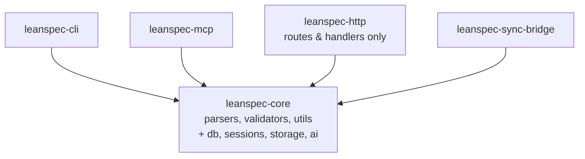

# Rust Monorepo Architecture Refactoring: Consolidate into Core

## Overview

The current Rust monorepo has tightly coupled components scattered across packages. Key issues:

1. **Sessions Management** - Embedded in `leanspec-http/src/sessions/` but CLI needs it
2. **Database Infrastructure** - SQLite code duplicated (sessions.db, chat.db) 
3. **Chat Storage** - Tightly coupled to HTTP server (`leanspec-http/src/chat_store.rs`)
4. **AI Worker Management** - HTTP-specific but conceptually independent (`leanspec-http/src/ai/`)
5. **Project Registry** - Could be shared infrastructure (`leanspec-http/src/project_registry.rs`)
6. **Configuration System** - Scattered with duplication (`leanspec-http/src/config.rs`)

### Current Problems

- **CLI depends on `leanspec-http`** just to access session management (see `leanspec-cli/src/commands/session.rs` lines 2-3)
- Database schema management duplicated
- Infrastructure code mixed with HTTP presentation layer
- Difficult to test components in isolation
- CLI binary includes unnecessary HTTP server overhead

### Current Dependencies

```toml
# leanspec-cli/Cargo.toml (CURRENT - problematic)
[dependencies]
leanspec-core = {path = "../leanspec-core"}
leanspec-http = {path = "../leanspec-http"}  # ❌ Only needed for sessions
```

### Proposed Solution

**Move db/sessions/storage/ai into `leanspec-core`** to create a comprehensive core library that both CLI and HTTP can depend on directly.

## Design

### Current Structure (Problematic)

```
rust/
├── leanspec-core/          # ~500 LOC - Only spec parsing/validation
│   ├── src/parsers/
│   ├── src/types/
│   ├── src/utils/
│   └── src/validators/
├── leanspec-cli/           # Depends on HTTP just for sessions ❌
│   └── src/commands/session.rs (imports from leanspec_http)
├── leanspec-http/          # ~5,500 LOC - Contains everything
│   ├── src/sessions/       # 2,509 lines
│   │   ├── adapter.rs      # 534 lines - Tool adapters
│   │   ├── db.rs          # 693 lines - Session database
│   │   ├── manager.rs     # 554 lines - Session manager
│   │   ├── mod.rs         # 20 lines
│   │   └── types.rs       # 262 lines - Session types
│   ├── src/ai/            # 804 lines
│   │   ├── manager.rs     # 136 lines
│   │   ├── mod.rs         # 7 lines
│   │   ├── protocol.rs    # 242 lines
│   │   └── worker.rs      # 419 lines
│   ├── src/chat_store.rs  # 444 lines
│   ├── src/project_registry.rs  # 539 lines
│   ├── src/config.rs      # 345 lines
│   ├── src/handlers/      # HTTP handlers only
│   └── src/routes.rs      # Route definitions
└── leanspec-mcp/
```

### Proposed Structure (Clean)

```
rust/
├── leanspec-core/          # EXPANDED - ~6,000+ lines
│   ├── src/parsers/        # (existing)
│   ├── src/types/          # (existing)
│   ├── src/utils/          # (existing)
│   ├── src/validators/     # (existing)
│   ├── src/db/             # NEW - Shared database infrastructure
│   │   ├── mod.rs          # Database connection management
│   │   ├── connection.rs   # Connection pooling, WAL mode
│   │   ├── migrations.rs   # Schema migration framework
│   │   └── error.rs        # Database error types
│   ├── src/sessions/       # MOVED from leanspec-http
│   │   ├── mod.rs          # Re-exports
│   │   ├── types.rs        # Session types (262 lines)
│   │   ├── database.rs     # SessionDatabase (693 lines)
│   │   ├── manager.rs      # SessionManager (554 lines)
│   │   └── adapters/       # Tool adapters
│   │       ├── mod.rs
│   │       ├── claude.rs   # ClaudeAdapter (from adapter.rs)
│   │       ├── copilot.rs  # CopilotAdapter
│   │       ├── codex.rs    # CodexAdapter
│   │       └── opencode.rs # OpenCodeAdapter
│   ├── src/storage/        # MOVED from leanspec-http
│   │   ├── mod.rs
│   │   ├── chat.rs         # ChatStore (from chat_store.rs, 444 lines)
│   │   ├── projects.rs     # ProjectRegistry (from project_registry.rs, 539 lines)
│   │   └── config.rs       # Config management (from config.rs, 345 lines)
│   └── src/ai/             # MOVED from leanspec-http
│       ├── mod.rs
│       ├── manager.rs      # AiWorkerManager (136 lines)
│       ├── protocol.rs     # Worker protocol (242 lines)
│       └── worker.rs       # AiWorker (419 lines)
├── leanspec-cli/           # Now depends only on core ✓
│   └── src/commands/session.rs  # Update imports to leanspec_core::sessions
├── leanspec-http/          # REDUCED - ~800 LOC
│   ├── src/handlers/       # HTTP handlers only
│   ├── src/routes.rs       # Route definitions
│   ├── src/state.rs        # AppState (simplified)
│   ├── src/types.rs        # HTTP-specific types
│   └── src/error.rs        # HTTP error types
├── leanspec-mcp/           # Can now use core directly
└── leanspec-sync-bridge/
```

### Dependency Graph



**Much simpler!** Everyone just depends on core.

### Files to Move (4,641 total lines)

| File | Lines | Destination |
|------|-------|-------------|
| `sessions/types.rs` | 262 | `core::sessions::types` |
| `sessions/db.rs` | 693 | `core::sessions::database` |
| `sessions/manager.rs` | 554 | `core::sessions::manager` |
| `sessions/adapter.rs` | 534 | Split into `core::sessions::adapters::*` |
| `sessions/mod.rs` | 20 | `core::sessions::mod` |
| `ai/manager.rs` | 136 | `core::ai::manager` |
| `ai/protocol.rs` | 242 | `core::ai::protocol` |
| `ai/worker.rs` | 419 | `core::ai::worker` |
| `ai/mod.rs` | 7 | `core::ai::mod` |
| `chat_store.rs` | 444 | `core::storage::chat` |
| `project_registry.rs` | 539 | `core::storage::projects` |
| `config.rs` | 345 | `core::storage::config` |

### Module Responsibilities in Core

#### `core::db` (NEW)
- SQLite connection management with WAL mode
- Connection pooling for concurrent access
- Schema migrations infrastructure
- Common database operations
- Error handling and retry logic
- Transaction support

#### `core::sessions` (MOVED FROM HTTP)
- Session types and lifecycle (`types.rs`)
- Session database operations (`database.rs`)
- Tool adapters (Claude, Copilot, Codex, OpenCode) in `adapters/` subdirectory
- Session manager with async execution (`manager.rs`)
- Process spawning and log capture

#### `core::storage` (MOVED FROM HTTP)
- Chat store (SQLite-backed chat sessions)
- Project registry (multi-project support)
- Configuration persistence (`~/.lean-spec/config.json`)
- Generic storage abstractions

#### `core::ai` (MOVED FROM HTTP)
- AI worker management
- Worker protocol definitions
- Chat payload handling via IPC

#### Updated Packages

**`leanspec-http`** (REDUCED SCOPE)
- HTTP routes and handlers **only**
- Request/response serialization
- Middleware (CORS, logging)
- WebSocket handlers
- All business logic delegates to `core::`

**`leanspec-cli`** (SIMPLIFIED)
- Command definitions and parsing
- Output formatting
- Direct usage of `core::sessions`, `core::storage`
- **No HTTP dependency** ✓

## Plan

### Phase 1: Expand Core Dependencies
- [ ] Update `leanspec-core/Cargo.toml` to add infrastructure deps:
  - `rusqlite = { version = "0.31", features = ["bundled"] }`
  - `tokio = { workspace = true }`
  - `uuid = { version = "1.10", features = ["v4"] }`
  - `async-trait = "0.1"`
  - `dirs = "5.0"`
  - `which = "6.0"`
- [ ] Add optional features for infrastructure components:
  ```toml
  [features]
  default = []
  sessions = ["rusqlite", "tokio", "uuid", "async-trait", "which"]
  storage = ["rusqlite", "tokio", "dirs", "uuid"]
  ai = ["tokio", "async-trait"]
  full = ["sessions", "storage", "ai"]
  ```
- [ ] Verify workspace Cargo.lock updates

### Phase 2: Create Database Infrastructure Module
- [ ] Create `leanspec-core/src/db/` directory
- [ ] Create `leanspec-core/src/db/mod.rs` with shared connection management
- [ ] Implement WAL mode and busy timeout settings
- [ ] Create database error types in `leanspec-core/src/db/error.rs`
- [ ] Extract common SQLite patterns from sessions/db.rs and chat_store.rs
- [ ] Add comprehensive unit tests

### Phase 3: Move Sessions to Core
- [ ] Create `leanspec-core/src/sessions/` directory
- [ ] Move `sessions/types.rs` → `core::sessions::types`
- [ ] Move `sessions/db.rs` → `core::sessions::database` (refactor to use `core::db`)
- [ ] Move `sessions/manager.rs` → `core::sessions::manager`
- [ ] Create `leanspec-core/src/sessions/adapters/` directory
- [ ] Split `sessions/adapter.rs` into separate files:
  - `adapters/mod.rs` - Trait definition and exports
  - `adapters/claude.rs` - ClaudeAdapter
  - `adapters/copilot.rs` - CopilotAdapter
  - `adapters/codex.rs` - CodexAdapter
  - `adapters/opencode.rs` - OpenCodeAdapter
- [ ] Update imports to use `core::db` instead of direct rusqlite
- [ ] Ensure no HTTP-specific dependencies
- [ ] Port all unit tests from original files

### Phase 4: Move Storage to Core
- [ ] Create `leanspec-core/src/storage/` directory
- [ ] Move `chat_store.rs` → `core::storage::chat` (refactor to use `core::db`)
- [ ] Move `project_registry.rs` → `core::storage::projects`
- [ ] Move `config.rs` → `core::storage::config`
- [ ] Update all imports to use `core::db`
- [ ] Port all unit tests

### Phase 5: Move AI Worker to Core
- [ ] Create `leanspec-core/src/ai/` directory
- [ ] Move `ai/manager.rs` → `core::ai::manager`
- [ ] Move `ai/protocol.rs` → `core::ai::protocol`
- [ ] Move `ai/worker.rs` → `core::ai::worker`
- [ ] Update imports and error types
- [ ] Port all unit tests

### Phase 6: Update HTTP Package
- [ ] Delete moved modules from `leanspec-http/src/`:
  - `sessions/` directory
  - `ai/` directory
  - `chat_store.rs`
  - `project_registry.rs`
  - `config.rs`
- [ ] Update `leanspec-http/Cargo.toml` to enable core features:
  ```toml
  leanspec-core = { path = "../leanspec-core", features = ["full"] }
  ```
- [ ] Update all imports to use `leanspec_core::`
- [ ] Simplify `state.rs` to use core modules directly
- [ ] Update handlers to delegate to core
- [ ] Run full HTTP test suite
- [ ] Update API documentation

### Phase 7: Update CLI Package
- [ ] Remove `leanspec-http` dependency from `leanspec-cli/Cargo.toml`
- [ ] Update `leanspec-cli/Cargo.toml` to enable core features:
  ```toml
  leanspec-core = { path = "../leanspec-core", features = ["sessions", "storage"] }
  ```
- [ ] Update `src/commands/session.rs`:
  - Change line 2: `use leanspec_http::config::config_dir;` → `use leanspec_core::storage::config::config_dir;`
  - Change line 3: `use leanspec_http::sessions::{...};` → `use leanspec_core::sessions::{...};`
- [ ] Remove HTTP-specific error handling
- [ ] Run CLI test suite
- [ ] Measure and document binary size reduction

### Phase 8: Update MCP Package (if needed)
- [ ] Check if MCP uses any moved modules
- [ ] Update imports if necessary
- [ ] Run MCP test suite

### Phase 9: Final Integration
- [ ] Update workspace `Cargo.toml` if needed
- [ ] Run full workspace build: `cargo build --workspace`
- [ ] Run all tests: `cargo test --workspace`
- [ ] Run clippy: `cargo clippy --workspace -- -D warnings`

### Phase 10: Documentation & Cleanup
- [ ] Update `leanspec-core/README.md` with expanded scope
- [ ] Document new modules in `leanspec-core/src/lib.rs`
- [ ] Update architecture docs
- [ ] Clean up any remaining deprecated code
- [ ] Update CI/CD if needed

## Test

### Unit Tests
- [ ] `core::db`: Connection management, migrations, error handling
- [ ] `core::sessions`: Session lifecycle, tool adapters, database ops
- [ ] `core::storage`: Chat store, project registry, config management
- [ ] `core::ai`: Worker management, protocol handling

### Integration Tests
- [ ] Sessions: Full lifecycle (Create → Start → Monitor → Stop)
- [ ] Storage: Multi-project management, chat CRUD operations
- [ ] CLI: Session commands work with new core modules
- [ ] HTTP: API endpoints delegate correctly to core

### Regression Tests
- [ ] All existing E2E tests pass
- [ ] CLI functionality unchanged
- [ ] HTTP API contracts maintained
- [ ] MCP tools continue working

### Performance Tests
- [ ] CLI startup time improved (HTTP deps removed)
- [ ] Session creation/management latency unchanged
- [ ] Database query performance maintained
- [ ] CLI binary size reduction measured

## Notes

### Current Code References

**CLI Session Command** (`leanspec-cli/src/commands/session.rs:2-3`):
```rust
use leanspec_http::config::config_dir;
use leanspec_http::sessions::{SessionDatabase, SessionManager, SessionMode, SessionStatus};
```

This is the **primary coupling** that necessitates this refactoring.

### Design Rationale

**Why consolidate into core instead of separate packages?**

1. **Simplicity** - Fewer packages to manage, simpler dependency graph
2. **Cohesion** - All domain + infrastructure logic in one place
3. **Build efficiency** - No unnecessary package boundaries
4. **Maintenance** - Single version, single source of truth
5. **Discovery** - Everything developers need is in `leanspec_core::`

**Why not keep infrastructure separate?**

- Core is already a library, not a binary
- Infrastructure (db, sessions, storage) serves the domain model
- CLI and HTTP both need the same infrastructure
- Optional features can control compilation

**Alternative considered: Multiple packages**

- **Rejected** - Adds package management overhead
- More complex versioning and publishing
- Cross-package refactoring more difficult
- Not needed at current scale

### Migration Strategy

1. **Incremental** - Move one module at a time
2. **Test-driven** - Move tests with code, verify at each phase
3. **No breaking changes** - Public APIs preserved
4. **Feature flags** - Use optional features to control compilation

### Core Dependencies to Add

```toml
# leanspec-core/Cargo.toml additions
[dependencies]
# Existing (keep)
serde = { workspace = true }
serde_yaml = { workspace = true }
serde_json = { workspace = true }
thiserror = { workspace = true }
walkdir = { workspace = true }
regex = { workspace = true }
chrono = { workspace = true }
petgraph = { workspace = true }
tiktoken-rs = { workspace = true }

# NEW for infrastructure
rusqlite = { version = "0.31", features = ["bundled"], optional = true }
tokio = { workspace = true, optional = true }
uuid = { version = "1.10", features = ["v4"], optional = true }
async-trait = { version = "0.1", optional = true }
which = { version = "6.0", optional = true }
dirs = { version = "5.0", optional = true }

[features]
default = []
sessions = ["rusqlite", "tokio", "uuid", "async-trait", "which"]
storage = ["rusqlite", "tokio", "dirs", "uuid"]
ai = ["tokio", "async-trait"]
full = ["sessions", "storage", "ai"]
```

### Benefits

✅ **CLI** - No HTTP dependency, smaller binary, faster builds  
✅ **HTTP** - Cleaner separation, just routing layer  
✅ **Core** - Comprehensive library, all features in one place  
✅ **Testing** - Easier to test infrastructure independently  
✅ **Future** - Desktop, other binaries can use core directly  

### Token Economy

This spec: ~2,100 tokens  
Estimated files to modify: ~30  
Estimated LOC to move: ~4,641  
New packages: 0 (consolidation!)  
Reduced duplication: ~500 LOC (shared db infrastructure)  

### Risks & Mitigations

| Risk | Impact | Mitigation |
|------|--------|------------|
| Breaking changes | High | Extensive testing at each phase |
| Test failures | Medium | Port all existing tests |
| Import errors | Low | Compiler will catch these |
| Feature flag complexity | Low | Document feature combinations |
| Binary size increase in core | Low | Features are optional |

### Verification Checklist

Before marking complete:
- [ ] `cargo build --workspace` succeeds
- [ ] `cargo test --workspace` passes
- [ ] `cargo clippy --workspace -- -D warnings` clean
- [ ] CLI binary size documented (before/after)
- [ ] All existing tests pass without modification
- [ ] No remaining imports from `leanspec_http` in CLI
- [ ] Documentation updated
